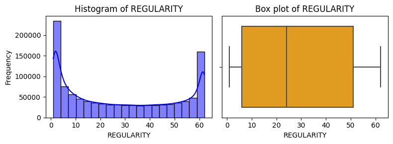
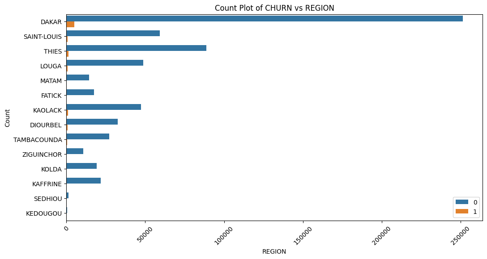
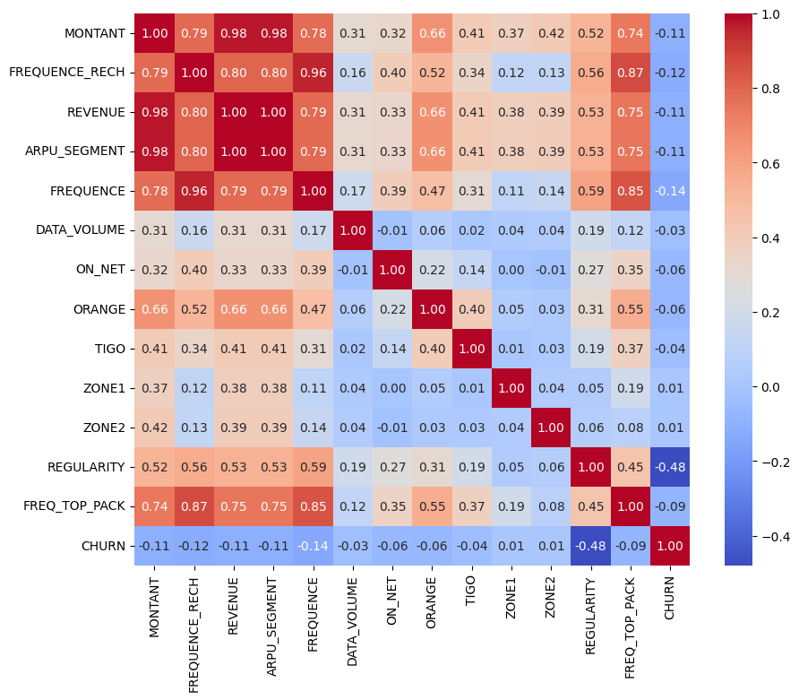

<div align="center">
    
</div>

<div align="center">
  <h1><b>ChurnGuard</b></h1>
</div>

# 📕 Table of Contents

- [📕 Table of Contents](#table-of-contents)
- [🎈 Introduction](#introduction)
- [♻ Data Features](#data-features)
- [📝 Overview](#overview)
- [📊 Exploratory Data Analysis](#exploratory-data-analysis)
- [📌 Demo](#demo)
- [💡 Prerequisites](#prerequisites)
- [🔧 Installation](#installation)
- [🚀 Usage](#usage)
- [📝 Article](#article)
- [🤝 Contributing](#contributing)
- [🔏 License](#license)
- [📚 References](#references)
- [👥 Team Antimony](#Team-Antimony)


## 🎈 Introduction
The ChurnGuard Project is a machine learning initiative aimed at predicting customer churn for an African telecommunications company (Expresso). It empowers providers to proactively retain customers with predictive analytics. The Project aims to develop a machine learning model capable of predicting customer churn. By leveraging historical customer data, the model assists businesses in identifying customers at risk of leaving, enabling proactive retention strategies.

## ♻ Data Features

- **user_id**: Unique identifier for each customer.
- **REGION**: Region where the customer is located.
- **TENURE**: Duration of the customer's subscription.
- **MONTANT**: Amount spent by the customer.
- **FREQUENCE_RECH**: Frequency of recharges by the customer.
- **REVENUE**: Revenue generated from the customer.
- **ARPU_SEGMENT**: Average Revenue Per User segment.
- **FREQUENCE**: Frequency of usage by the customer.
- **DATA_VOLUME**: Volume of data consumed by the customer.
- **ON_NET**: Calls made to the same network.
- **ORANGE**: Calls made to the Orange network.
- **TIGO**: Calls made to the Tigo network.
- **REGULARITY**: Regularity of the customer's activity.
- **FREQ_TOP_PACK**: Frequency of the customer's top package usage.

## 📝 Overview

The project involves training machine learning models to predict customer churn based on various features extracted from telecom customer data. By deploying these models, businesses can implement targeted strategies to retain customers and reduce churn rates.

## 📊 Exploratory Data Analysis

Explore the dataset used for training the machine learning model. View data visualizations and insights gained from the analysis in the [Exploratory Data Analysis](./notebooks.ipynb) notebook.
Click [Here](https://app.powerbi.com/groups/me/reports/3c14bfce-a782-44be-a2a7-db08099b3302/ReportSection?experience=power-bi) to garner insights from the power BI Dashboard.





## 📌 Demo
### Home Page

- This image showcases the home page of the Customer Churn Prediction App. Users are greeted with a user-friendly interface where they can access various features of the application.

### Application Interface

- Here, you can see the main interface of the application, which offers users the ability to interact with the machine learning model. Users can input data or select options to predict customer churn probability.

### Dashboard

- The dashboard provides users with insightful visualizations and key performance indicators (KPIs) related to customer churn. Users can explore different visualizations to gain a deeper understanding of the data and identify trends or patterns.

## 💡 Prerequisites

Before running this project, ensure you have the following dependencies installed:

- Python
- Streamlit
- pyodbc
- Pandas
- NumPy
- Matplotlib
- Seaborn
- Plotly
- Scikit-learn


## 🔧 Installation

1. Clone this repository to your local machine.
    
```bash
    git clone https://github.com/Elphoxa/ChurnGuard-Project.git
```

2. Navigate into the repository directory:
   
    ```bash
    cd ChurnGuard-Project
    ```

3. Create a virtual environment
    
    ```bash
        python -m venv env
    ```

4. Activate the virtual environment
    
    ```bash
    source env/bin/activate

    ```
5. Install the required dependencies

    ```bash
        pip install -r requirement.txt
    ```
## 🧭 Usage
To run the Streamlit app, execute the following command:
    
    streamlit run main.py
    
- The webpage will automatically open in your default browser
- Sign in to the app using the following credentials: username= beatit and password:abc123.
- Use the sidebar to navigate between different pages.
- Proceed to test a prediction by navigating to the prediction page.
- Input data or select options as prompted then hit the predict key
- **Important Notes: 💬** 
           
    - Access to the View Data page may be restricted as the secrets file is not committed to Git.
    - Exploratory Data Analysis (EDA): Provides visualizations to explore the dataset and understand
        the underlying patterns (Interactive dashboard allows you to interact with the data and explore different visualizations).
    - Key Performance Indicators (KPIs): Displays important metrics such as churn rate, average total revenue per user, average recharge frequency, etc.
    
-**Docker Image:** The Docker image for the ChurnGuard API is available on [Docker Hub](https://hub.docker.com/repository/docker/elphoxa56/churn_guard), ensuring efficient API deployment and containerization.

## 📝 Article

Read the article on this project [Here](https://www.linkedin.com/pulse/unveiling-customer-churn-guard-efosa-dave-omosigho-oiqzf)

## 🤝 Contributing

If you'd like to contribute to this project, please follow these steps:

- Fork the repository.
- Create a new branch (git checkout -b feature/your-feature).
- Make your changes.
- Commit your changes (git commit -am 'Add some feature').
- Push to the branch (git push origin feature/your-feature).
- Create a new Pull Request.

## 🔏 License

This project is licensed under the MIT License. See the [LICENSE](LICENSE) file for details.

## 📚 References

- [FastAPI Documentation](https://fastapi.tiangolo.com/)
- [Scikit-learn Documentation](https://scikit-learn.org/stable/documentation.html)
- [Docker Documentation](https://docs.docker.com/)
- [Docker Hub](https://hub.docker.com/)

## 👥 Team Antimony

🤵 **Efosa Dave Omosigho** (Team Lead)
- [GitHub Profile](https://github.com/Elphoxa) 🐙
- [LinkedIn Profile](https://www.linkedin.com/in/efosa-omosigho) 💼

🤵 **Philip Ofori Kwaning** (Member)
- [GitHub Profile](https://github.com/speedcode-x)
- [LinkedIn Profile](https://www.linkedin.com/in/philip-kwaning)

🤵 **Richmond Kantam Nana Addo Yendam** (Member)
- [GitHub Profile](https://github.com/RichieRichMoC)
- [LinkedIn Profile](https://www.linkedin.com/in/richmond-kantam-9b6049114/)

🤵 **Marufu Loveness Enesia** (Member)
- [GitHub Profile](https://github.com/Lmarufu)
- [LinkedIn Profile](https://www.linkedin.com/in/loveness-marufu)

🤵 **Abessolo Ateba Abhas** (Member)
- [GitHub Profile](https://github.com/Abessolo-26)
- [LinkedIn Profile](https://www.linkedin.com/in/abessolo-ateba-abhas/)

🤵 **Prince Eyram Kofi Adzanku** (Member)
- [GitHub Profile](https://github.com/prynz-eyram)
- [LinkedIn Profile](https://www.linkedin.com/in/prince-eyram-kofi-adzanku)